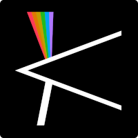

GPU accelerated raw video processing


Kinochrome is currently in an alpha state. Expect bugs, which you are encouraged to report.

# Features
- opening losslessly compressed and uncompressed MLV and CinemaDNG files
- automatic focus pixel correction
- Vulkan accelerated demosaicing and colour grading on the GPU
- real time playback
- modern colour science in scene refered linear space
- white balance picker
- export to plentitude of formats that [ffmpeg](https://ffmpeg.org) supports
- multithreaded CinemaDNG export
- clean code base with separation of UI and video processing code

# Planned features
- audio playback
- dual ISO interpolation on the GPU
- node graph based color grading pipeline
- (maybe a simple video editor in the future)

# Building
Requirements:
- [Rust toolchain](https://rustup.rs)
- [shaderc](https://github.com/google/shaderc) for compiling the Vulkan shaders
- _Optionally_ [ffmpeg](https://ffmpeg.org) for export

Clone the repository:
```
git clone https://git.sr.ht/~grego/kinochrome
```

Clone the focus pixels submodule:
```
git submodule update --init
```
Compile the shaders:
```
make
```
Then build the application:
```
cargo build --release
```

To run the application:
```
cargo run --release
```
